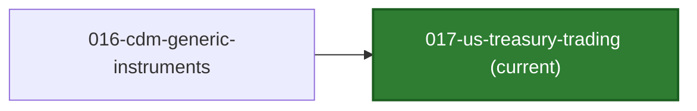
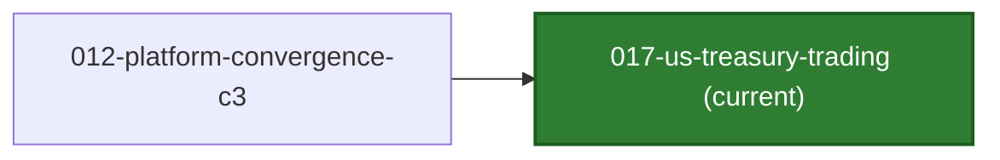

# TraderX Generated Code Snapshot

This branch is an auto-published generated-code snapshot for FINOS TraderX.

 

- State ID: `017-us-treasury-trading`
- State Title: `U.S. Treasury Trading`
- Status: `implemented`
- Suggested Version Tag: `generated/017-us-treasury-trading/v1`
- Source Branch: `main`
- Source Commit: `808b683ec73267dd9cb52d1d1887d573856357f2`
- Generated At (UTC): `2026-08-03T19:17:02Z`

## State Summary

- Builds on state `016` and preserves inherited stock and ETF behavior.
- Adds five fixed-rate U.S. Treasury Debt instruments with verified FIGIs, auction-price provenance, simulated clean prices, and approximate YTM.
- Adds long-only face-amount trading, retry-safe synchronous Treasury booking, and unified multi-asset UI behavior.

## State Lineage

| Direction | State | Branch | Compare |
| --- | --- | --- | --- |
| Previous | `016-cdm-generic-instruments` | [code/generated-state-016-cdm-generic-instruments](https://github.com/jduitz/traderX/tree/code%2Fgenerated-state-016-cdm-generic-instruments) | 🔍 [compare](https://github.com/jduitz/traderX/compare/code%2Fgenerated-state-016-cdm-generic-instruments...code%2Fgenerated-state-017-us-treasury-trading) |

State sets:
- Previous states: `016-cdm-generic-instruments`
- Next states: `none`

## Convergence Status

- Convergence state: `false`
- Convergence level: `none`
- Lineage role: `canonical`
- Dotted-line parents: `none`
- Previous convergence milestone: [012-platform-convergence-c3](https://github.com/jduitz/traderX/tree/code%2Fgenerated-state-012-platform-convergence-c3) (🔍 [compare](https://github.com/jduitz/traderX/compare/code%2Fgenerated-state-012-platform-convergence-c3...code%2Fgenerated-state-017-us-treasury-trading))
- Next convergence milestone: `none`

### Convergence Neighborhood

## Runtime Guidance

See `RUN_FROM_CLONE.md` for clone-first runtime instructions.

## API Explorer

- API explorer (ingress): `http://localhost:8080/api/docs`

## Interactive URLs

- UI (ingress): `http://localhost:8080`
- API explorer (ingress): `http://localhost:8080/api/docs`
- Instruments: `http://localhost:18085/instruments`
- Treasury quote: `http://localhost:18100/prices/UST-20360515`
- Grafana dashboards (ingress): `http://localhost:8080/grafana/`
- Grafana local admin: `http://localhost:3001`
- Prometheus: `http://localhost:9090`
- Order matcher health: `http://localhost:18110/health`

## Grafana Access

- Public dashboards: `http://localhost:8080/grafana/`
- Local admin URL: `http://localhost:3001`
- The start script prints the active local admin credential.
- Default convention: user from `TRADERX_GRAFANA_ADMIN_USER` or `traderx-admin`; password from `TRADERX_GRAFANA_ADMIN_PASSWORD` or `traderx-state-017`.

Detailed clone-first instructions: [RUN_FROM_CLONE.md](./RUN_FROM_CLONE.md)
Functional validation guide: [FUNCTIONAL_TESTING.md](./FUNCTIONAL_TESTING.md)

## Learning Docs In This Snapshot

- [Docs Index](./docs/README.md)
- [Learning Index](./docs/learning/README.md)
- [Component List](./docs/learning/component-list.md)
- [System Design](./docs/learning/system-design.md)
- [Software Architecture](./docs/learning/software-architecture.md)
- [Component Diagram](./docs/learning/component-diagram.md)

## Canonical Specs And Docs

Canonical source-of-truth is maintained in the SpecKit authoring branch, not in this code snapshot branch.

- Feature pack: `specs/017-us-treasury-trading`
- Generation entrypoint: `bash pipeline/generate-state.sh 017-us-treasury-trading`
- Developer learning guide for this snapshot: [LEARNING.md](./LEARNING.md)
- Functional validation guide: [FUNCTIONAL_TESTING.md](./FUNCTIONAL_TESTING.md)
- Snapshot metadata: [STATE.md](./STATE.md), [state.json](./.traderx-state/state.json)
- Canonical Getting Started (main): https://github.com/jduitz/traderX/blob/main/docs/spec-kit/getting-started-with-traderx.md
- Source commit: https://github.com/jduitz/traderX/commit/808b683ec73267dd9cb52d1d1887d573856357f2
- Feature pack at source commit: https://github.com/jduitz/traderX/tree/808b683ec73267dd9cb52d1d1887d573856357f2/specs/017-us-treasury-trading
- SpecKit docs at source commit: https://github.com/jduitz/traderX/tree/808b683ec73267dd9cb52d1d1887d573856357f2/docs/spec-kit
