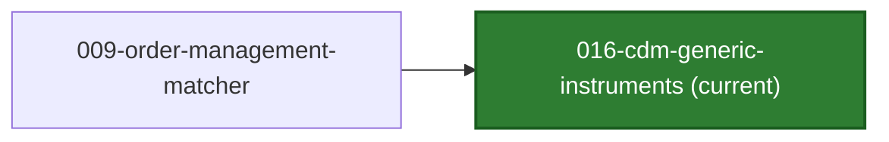
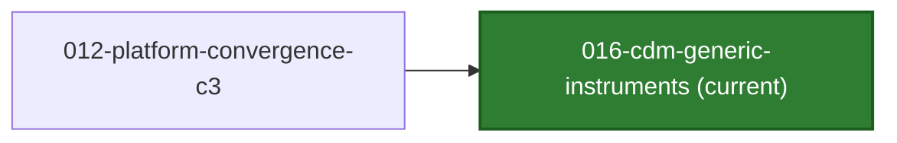

# TraderX Generated Code Snapshot

This branch is an auto-published generated-code snapshot for FINOS TraderX.

 

- State ID: `016-cdm-generic-instruments`
- State Title: `CDM Generic Instruments`
- Status: `implemented`
- Suggested Version Tag: `generated/016-cdm-generic-instruments/v1`
- Source Branch: `main`
- Source Commit: `25ea8b839e2fdd1dfe9b77f8917e3d5e4a8260bd`
- Generated At (UTC): `2026-07-21T19:00:32Z`

## State Summary

- Builds on state `009` and preserves order-management, pricing, and observability runtime behavior.
- Replaces the two-string stock concept with an instrument model shaped after the FINOS Common Domain Model, carrying CDM asset identifiers (`BBGTICKER`, `FIGI`) and security types.
- Replaces `/stocks` with `/instruments` as a declared, non-aliased break, and seeds ETFs alongside equities so a second CDM `securityType` is exercised at runtime.

## State Lineage

| Direction | State | Branch | Compare |
| --- | --- | --- | --- |
| Previous | `009-order-management-matcher` | [code/generated-state-009-order-management-matcher](https://github.com/jduitz/traderX/tree/code%2Fgenerated-state-009-order-management-matcher) | 🔍 [compare](https://github.com/jduitz/traderX/compare/code%2Fgenerated-state-009-order-management-matcher...code%2Fgenerated-state-016-cdm-generic-instruments) |

State sets:
- Previous states: `009-order-management-matcher`
- Next states: `none`

## Convergence Status

- Convergence state: `false`
- Convergence level: `none`
- Lineage role: `canonical`
- Dotted-line parents: `none`
- Previous convergence milestone: [012-platform-convergence-c3](https://github.com/jduitz/traderX/tree/code%2Fgenerated-state-012-platform-convergence-c3) (🔍 [compare](https://github.com/jduitz/traderX/compare/code%2Fgenerated-state-012-platform-convergence-c3...code%2Fgenerated-state-016-cdm-generic-instruments))
- Next convergence milestone: `none`

### Convergence Neighborhood

## Runtime Guidance

See `RUN_FROM_CLONE.md` for clone-first runtime instructions.

## API Explorer

- API explorer (ingress): `http://localhost:8080/api/docs`

## Interactive URLs

- UI (ingress): `http://localhost:8080`
- API explorer (ingress): `http://localhost:8080/api/docs`
- Instruments: `http://localhost:18085/instruments`
- Instruments (ingress): `http://localhost:8080/reference-data/instruments`
- Grafana dashboards (ingress): `http://localhost:8080/grafana/`
- Grafana local admin: `http://localhost:3001`
- Prometheus: `http://localhost:9090`
- Order matcher health: `http://localhost:18110/health`

## Grafana Access

- Public dashboards: `http://localhost:8080/grafana/`
- Local admin URL: `http://localhost:3001`
- The start script prints the active local admin credential.
- Default convention: user from `TRADERX_GRAFANA_ADMIN_USER` or `traderx-admin`; password from `TRADERX_GRAFANA_ADMIN_PASSWORD` or `traderx-state-016`.

Detailed clone-first instructions: [RUN_FROM_CLONE.md](./RUN_FROM_CLONE.md)
Functional validation guide: [FUNCTIONAL_TESTING.md](./FUNCTIONAL_TESTING.md)

## Learning Docs In This Snapshot

- [Docs Index](./docs/README.md)
- [Learning Index](./docs/learning/README.md)
- [Component List](./docs/learning/component-list.md)
- [System Design](./docs/learning/system-design.md)
- [Software Architecture](./docs/learning/software-architecture.md)
- [Component Diagram](./docs/learning/component-diagram.md)

## Canonical Specs And Docs

Canonical source-of-truth is maintained in the SpecKit authoring branch, not in this code snapshot branch.

- Feature pack: `specs/016-cdm-generic-instruments`
- Generation entrypoint: `bash pipeline/generate-state.sh 016-cdm-generic-instruments`
- Developer learning guide for this snapshot: [LEARNING.md](./LEARNING.md)
- Functional validation guide: [FUNCTIONAL_TESTING.md](./FUNCTIONAL_TESTING.md)
- Snapshot metadata: [STATE.md](./STATE.md), [state.json](./.traderx-state/state.json)
- Canonical Getting Started (main): https://github.com/jduitz/traderX/blob/main/docs/spec-kit/getting-started-with-traderx.md
- Source commit: https://github.com/jduitz/traderX/commit/25ea8b839e2fdd1dfe9b77f8917e3d5e4a8260bd
- Feature pack at source commit: https://github.com/jduitz/traderX/tree/25ea8b839e2fdd1dfe9b77f8917e3d5e4a8260bd/specs/016-cdm-generic-instruments
- SpecKit docs at source commit: https://github.com/jduitz/traderX/tree/25ea8b839e2fdd1dfe9b77f8917e3d5e4a8260bd/docs/spec-kit
