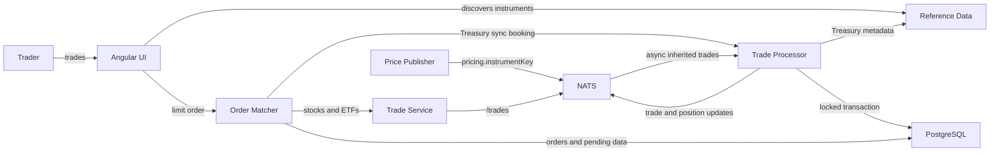

# Component Diagram

State: `017-us-treasury-trading`

```mermaid
flowchart LR
  trader["Trader"]
  ui["Angular UI"]
  reference["Reference Data"]
  pricing["Price Publisher"]
  matcher["Order Matcher"]
  tradeService["Trade Service"]
  processor["Trade Processor"]
  postgres["PostgreSQL"]
  nats["NATS"]

  trader -->|trades| ui
  ui -->|discovers instruments| reference
  pricing -->|pricing.instrumentKey| nats
  ui -->|limit order| matcher
  matcher -->|stocks and ETFs| tradeService
  matcher -->|Treasury sync booking| processor
  tradeService -->|/trades| nats
  nats -->|async inherited trades| processor
  processor -->|Treasury metadata| reference
  processor -->|locked transaction| postgres
  matcher -->|orders and pending data| postgres
  processor -->|trade and position updates| nats
```
