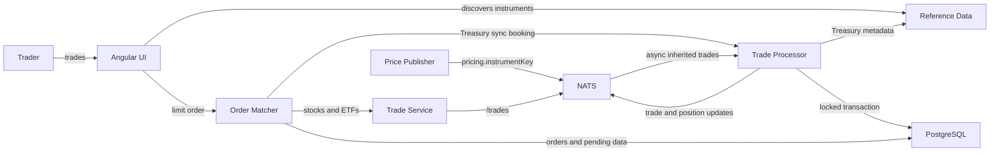

# Software Architecture

State: `017-us-treasury-trading`
Title: `U.S. Treasury Trading`

## Architecture Summary

Adds five fixed-rate Treasuries, clean pricing, long-only validation, and retry-safe synchronous order booking while preserving inherited stock and ETF flows.

## Entrypoints

## Notes

## Diagram

See [Component Diagram](./component-diagram.md).

## Detailed Architecture (Spec Extract)

# U.S. Treasury Trading

Adds five fixed-rate Treasuries, clean pricing, long-only validation, and retry-safe synchronous order booking while preserving inherited stock and ETF flows.

- Generated from: `system/architecture.model.json`
- Canonical flows: `system/end-to-end-flows.md`

## Architecture Diagram

## Node Catalog

| Node | Kind | Label | Notes |
| --- | --- | --- | --- |
| `trader` | actor | Trader | Uses unified tickets and blotters. |
| `ui` | component | Angular UI | Groups stocks, ETFs, and Treasuries. |
| `reference` | service | Reference Data | Serves instrumentKey/displayName and CDM-shaped Debt economics. |
| `pricing` | service | Price Publisher | Publishes simulated clean prices and approximate YTM. |
| `matcher` | service | Order Matcher | Reserves face amount and reconciles pending Treasury executions. |
| `tradeService` | service | Trade Service | Keeps inherited asynchronous stock/ETF submission and early Treasury validation. |
| `processor` | service | Trade Processor | Authoritative idempotent booking with pessimistic position locking. |
| `postgres` | database | PostgreSQL | Stores accounts, orders, pending execution data, trades, and positions. |
| `nats` | broker | NATS | Carries price and account-scoped trade/position/order updates. |

