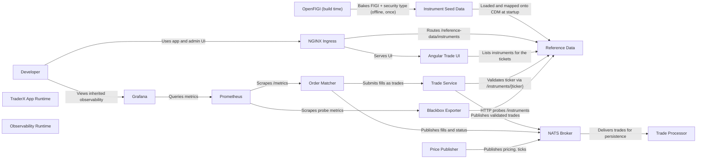

# CDM Generic Instruments

Replaces TraderX's two-string stock concept with an instrument model shaped after the FINOS Common Domain Model. Reference data serves /instruments with CDM asset identifiers and security types, and ETFs join equities in the seed universe. The runtime topology is inherited from state 009 unchanged.

- Generated from: `system/architecture.model.json`
- Canonical flows: `system/end-to-end-flows.md`

## Architecture Diagram

## Node Catalog

| Node | Kind | Label | Notes |
| --- | --- | --- | --- |
| `developer` | actor | Developer | Local developer using this state. |
| `openfigi` | actor | OpenFIGI (build time) | Symbology source consulted once, offline, to bake FIGI identifiers into seed data. Never called at runtime. |
| `app_runtime` | boundary | TraderX App Runtime | State 009 order-management runtime, carried forward with a CDM-shaped instrument model. |
| `obs_runtime` | boundary | Observability Runtime | LGTM + OTel stack inherited from state 007 unchanged. |
| `ingress` | service | NGINX Ingress | Routes UI, API, and order admin traffic. Unchanged. |
| `trade_ui` | service | Angular Trade UI | Trade ticket, blotters, and admin tab. Fetches the instrument list from /instruments. |
| `reference_data` | service | Reference Data | Serves /instruments and /instruments/{ticker}. CDM Security-shaped records with BBGTICKER and FIGI identifiers. /stocks is removed, not aliased. |
| `instrument_seed` | service | Instrument Seed Data | data/instruments.csv plus the supplemental seed list. Identifiers and security types baked in offline; equities and ETFs. |
| `trade_service` | service | Trade Service | Validates a trade's security against /instruments/{ticker} before publishing it. |
| `order_matcher` | service | Order Matcher | Matches open orders and emits lifecycle and fill events. Unchanged; now exercised with ETFs. |
| `price_publisher` | service | Price Publisher | Publishes pricing.<TICKER> ticks. Supported universe extended with five ETFs to keep the inherited alignment contract. |
| `nats` | service | NATS Broker | Realtime transport for pricing, trade, position, and order subjects. No subject changes. |
| `trade_processor` | service | Trade Processor | Consumes fills and persists trades/positions. Unchanged. |
| `prometheus` | service | Prometheus | Scrapes order metrics and blackbox probes. |
| `blackbox` | service | Blackbox Exporter | Probes runtime endpoints. Its reference-data target moves to /instruments. |
| `grafana` | service | Grafana | Inherited dashboards, re-scoped to the traderx-state-016 compose project. |

